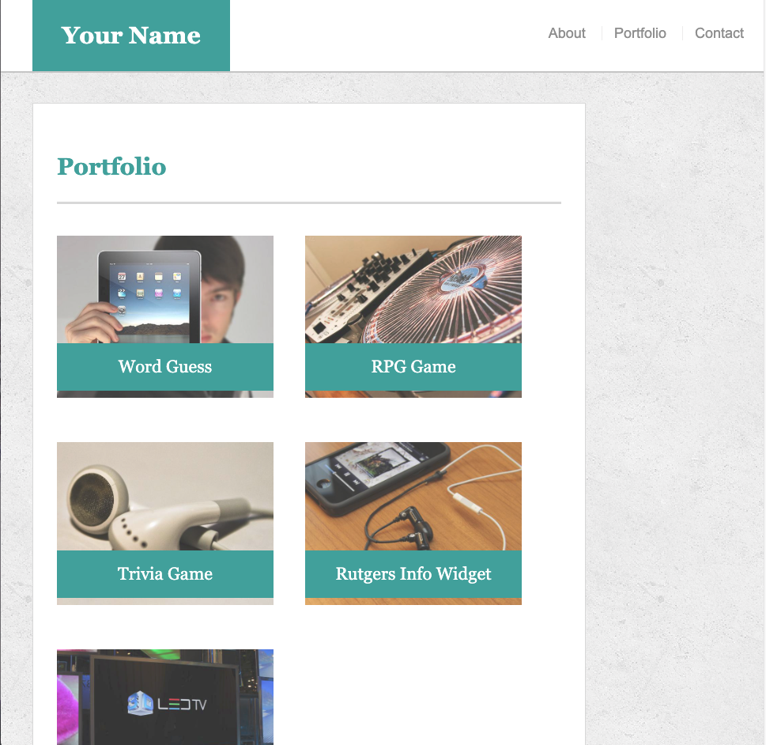
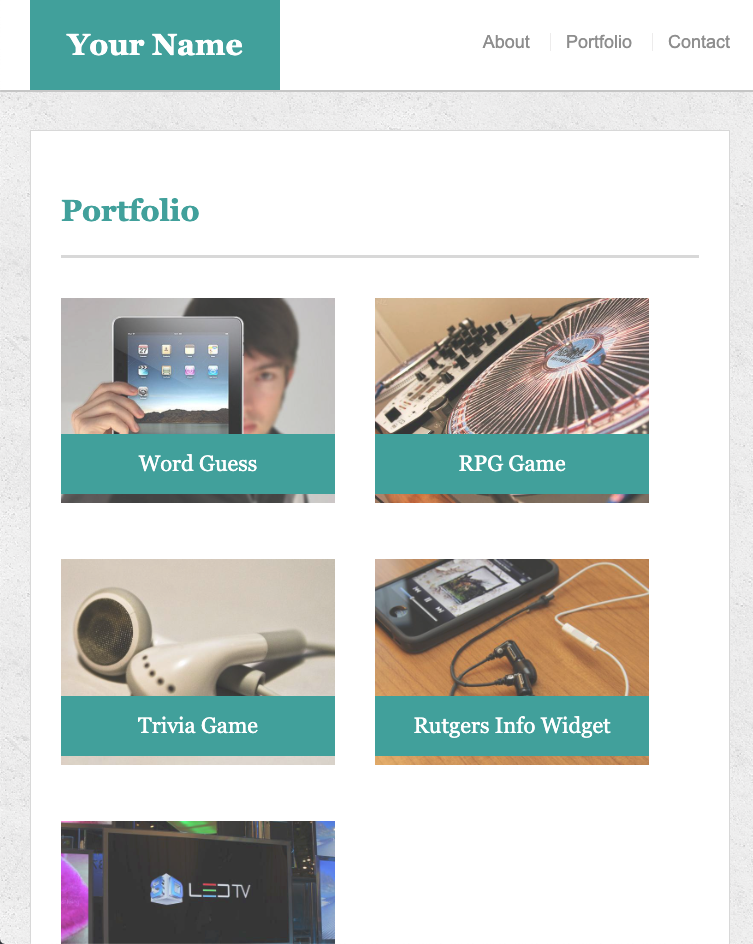
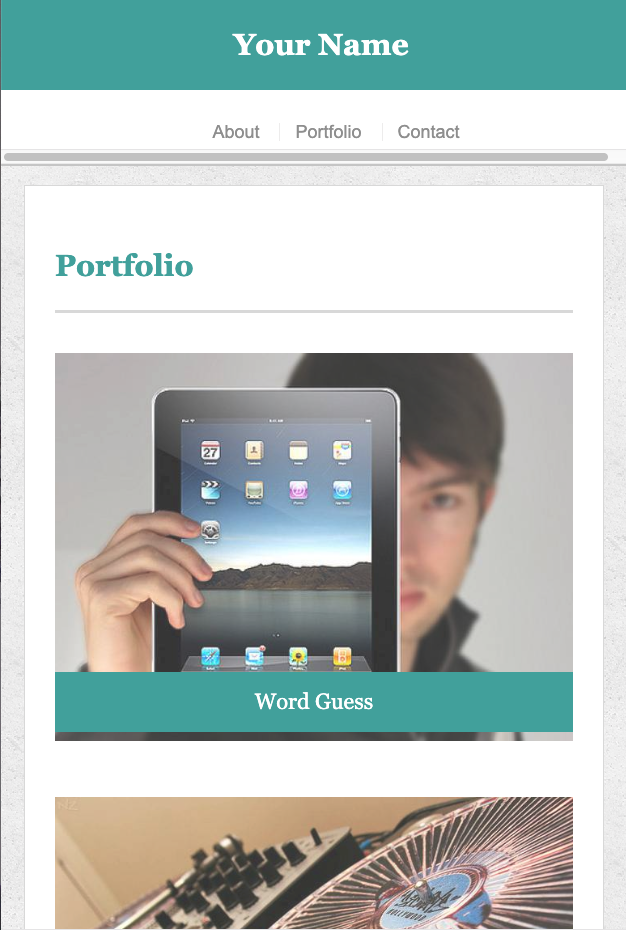

# Responsive-Portfolio

## Pictures of Site*

*there are three pages in this site; as an example one page (portfolio page) is displayed above with three widths (980px, 768px, 640px) to display the use of media queries 

## Description of Site
A basic portfolio for the purpose of: 
1. Practicing newly learned skills in media queries for webpage responsiveness

## Technologies Used
1. HTML
2. CSS (with a focus on media queries)

## Author(s): [Minori Hashimoto](https://github.com/minori-fh)